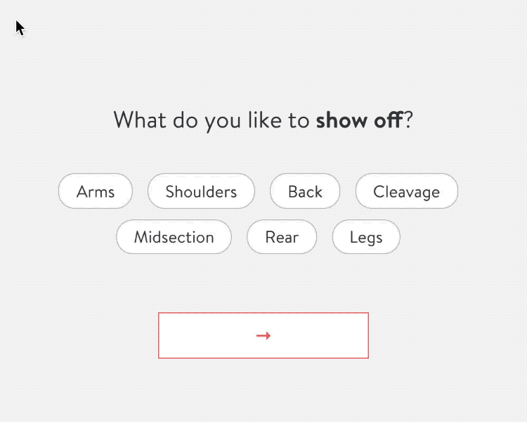

# Stitch Fix Front-End Exercise

When a user first signs up for Stitch Fix, we ask them to fill out a style profile so we can begin to understand their preferences. We're currently redesigning this survey to be more mobile-friendly and visually engaging.

In one section of the survey, we ask potential clients what they love to show off. Using the answers to that question, we follow up and ask if there are other things they prefer to downplay. The intended behavior and UI are shown here:

1. User is prompted to select what they like to show off.
1. Visual feedback helps the user understand the interaction: selected items change appearance. The "next" button is not disabled (users are not required to make a selection) but does have a hover state.
1. Previously selected answers are then removed from the follow-up question.

We've provided you with a repo containing some basic markup, CSS, and React. Your job is to use the starting materials to implement this feature as shown, using any additional tools or libraries you see fit.

You're free to rewrite any markup, CSS, or JS. Treat this like an actual work assignment and submit something that meets your own standards.

## Getting Started

- Install dependencies with `yarn install`.
- Start the development server with `yarn start` and visit the application at [http://localhost:8080](http://localhost:8080).
- Run the test suite with `yarn test`. We use Jest; refer to the [Jest docs](https://jestjs.io/docs/en/expect.html#content) if needed.
- Lint with `yarn lint`.

## Requirements

- `yarn install` and `yarn start` must work with no errors when we run them locally.
- How and what you choose to test is up to you, but `yarn test` must pass when we run it locally.
- Please spend no more than five hours on this, even if you don't consider your solution "complete". We value your time, and we value efficient solutions that are not overbuilt.

## Tips and Hints

- There are no hidden requirements to see which tools, frameworks, or patterns you use.
- Consider this the first iteration of your solution. What you choose to prioritize is just as meaningful as your overall progress. We'll use it as a starting point for more discussion later in the interview process.
- We've deliberately left a lot of room for improvement in different aspects of this code (HTML, CSS and JS.) Focus on your strengths.

## Ready?

Launch the [dev server](/) and start coding! 😀

## Greg's Notes

I changed the watermelon color to be slightly darker to be more accessible. The previous color did not produce enough contrast with the white button text. By making these buttons WCAG 2 AA compliant, more users will be better able to use stitchfix.com. This color change is merely a suggestion that can easily be undone. I understand that the previous shade of red is being used throughout Stitch Fix's site.

I also added subtle rings around the in-focus element to improve keyboard navigation. Those visual cues will also enhance the user's experience without drawing attention from the task at hand.
